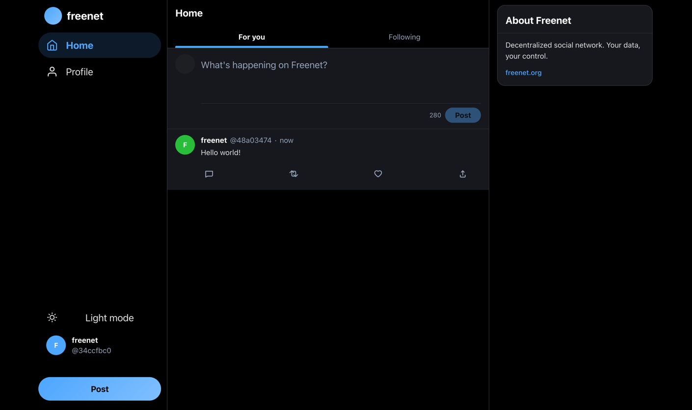

# Freenet Microblogging - Decentralized Social on Freenet

Freenet Microblogging is a decentralized Twitter/X-like application built on
[Freenet](https://freenet.org), designed to provide censorship-resistant social networking where
users own their data. It features a web-based interface built with TypeScript and Vite, Rust/WASM
contracts for post storage and social graph, and an Ed25519 identity delegate for cryptographic
signing.



## Roadmap

- [x] Posts contract with 280-character limit and content-hash deduplication
- [x] Follows contract for social graph (follow/unfollow)
- [x] Likes contract for post reactions
- [x] Ed25519 identity delegate with keypair generation and signing
- [x] Web UI with feed, compose box, profile, sidebar, dark/light mode
- [x] Onboarding flow with identity creation and import
- [x] Real-time post updates via contract subscription
- [ ] Wire likes to contract (currently local-only)
- [ ] Wire follows to contract (Following tab exists but empty)
- [ ] Post search and filtering
- [ ] Media attachments
- [ ] GhostKey support for anonymous posting

## Getting Started

### Building and Running

1. Install dependencies:

   ```bash
   # Install Rust with wasm target
   curl --proto '=https' --tlsv1.2 -sSf https://sh.rustup.rs | sh
   rustup target add wasm32-unknown-unknown

   # Install Node.js (v18+)
   # See https://nodejs.org/en/download

   # Install Freenet tools
   cargo install freenet
   cargo install fdev

   # Install BLAKE3 hash tool (used for delegate key computation)
   cargo install b3sum
   ```

2. Clone and set up:

   ```bash
   # Clone the repository
   git clone git@github.com:freenet/freenet-microblogging.git
   cd freenet-microblogging

   # Clone freenet-stdlib as a sibling directory (required for TypeScript SDK)
   cd .. && git clone git@github.com:nicobao/freenet-stdlib.git && cd freenet-microblogging

   # Install web dependencies
   cd web && npm install && cd ..
   ```

3. Build and publish:

   ```bash
   # Set target directory (required by Makefile)
   export CARGO_TARGET_DIR=$(pwd)/target

   # Full build: contracts + delegate + web app + publish all
   make build
   ```

4. Run the node:

   ```bash
   make run-node
   ```

5. Open the web app URL printed during publish
   (e.g. `http://127.0.0.1:7509/contract/web/<hash>/`)

### Key Development Commands

```bash
# Rebuild just the web app
make webapp publish-webapp

# Rebuild a single contract
make posts publish-posts
make follows publish-follows
make likes publish-likes

# Rebuild identity delegate
make identity publish-identity

# Run all tests (Rust + web)
make test

# Type check everything
make check

# Reset node data (required when republishing contracts)
make clean-node

# Vite dev server (without Freenet)
cd web && npm run dev
```

## Technical Details

### Project Structure

- [contracts/posts](contracts/posts/): Posts feed contract (store, validate, merge)
- [contracts/follows](contracts/follows/): Follow graph contract
- [contracts/likes](contracts/likes/): Like graph contract
- [delegates/identity](delegates/identity/): Ed25519 identity delegate
- [web](web/): TypeScript + Vite web application

### Architecture

The system is built using:

- **Freenet Contracts**: Rust/WASM contracts with commutative merge for conflict-free replication
- **Freenet Delegates**: Client-side WASM modules for identity and cryptographic operations
- **freenet-stdlib**: TypeScript SDK for WebSocket communication with the Freenet node
- **Vite**: Fast build toolchain for the web app, served as a webapp contract
- **Ed25519**: Elliptic curve cryptography for identity and post signing
- **BLAKE3**: Content-addressable hashing for post deduplication and delegate key computation

### Contract Architecture

Posts are stored in a commutative contract that merges updates from multiple users deterministically.
The core state structure is defined in [contracts/posts/src/lib.rs](contracts/posts/src/lib.rs):

```rust
#[derive(Serialize, Deserialize)]
struct PostsFeed {
    posts: Vec<Post>,
}

#[derive(Serialize, Deserialize, Clone)]
pub struct Post {
    pub id: String,                    // "{author_pubkey}-{timestamp_ms}"
    pub author_pubkey: String,         // hex-encoded public key
    pub author_name: String,           // display name
    pub author_handle: String,         // @handle
    pub content: String,               // post text (max 280 chars)
    pub timestamp: u64,                // unix timestamp milliseconds
    pub signature: Option<Box<[u8]>>,  // Ed25519 signature over content
}
```

Each contract handles its own state merging:

- [Posts](contracts/posts/src/lib.rs): Append-only feed, deduplication by BLAKE3 content hash
- [Follows](contracts/follows/src/lib.rs): Set-based merge (union of follow relationships)
- [Likes](contracts/likes/src/lib.rs): Set-based merge (union of likes per post)

### Identity Delegate

The identity delegate runs client-side in the Freenet node and manages Ed25519 keypairs. It supports:

- **CreateIdentity**: Generate a new keypair with display name
- **GetIdentity**: Retrieve the current identity
- **SignPost**: Sign post content for authenticity
- **ExportIdentity / ImportIdentity**: Transfer identity between devices

The delegate key is computed as `BLAKE3(BLAKE3(wasm_bytes))` with empty parameters, and the code
hash as `BLAKE3(wasm_bytes)`. Both are required for the node to locate the delegate in its store.

### Privacy Model

- Posts are currently public and readable by anyone with the contract address
- Identity keys are stored locally in the node's delegate store
- Post signatures provide authenticity but not confidentiality
- Future versions may support encrypted posts and private feeds

## License

Freenet Microblogging is open-source software. See [LICENSE](LICENSE) for details.
